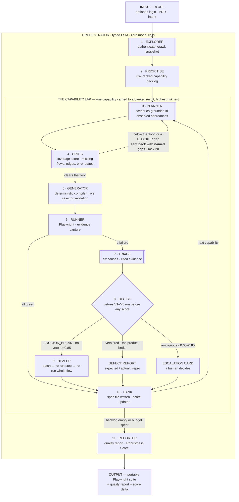

# 04 · System Architecture

> **Governing principle:** agency where the world is unknown, determinism where the answer will be audited ([ADR-011](../decisions/ADR-011-agent-topology.md)).
> **Status:** rewritten at Batch 2 against the real brief. Supersedes the pre-brief edition, whose FSM assumed a human-supplied test intent and no exploration.
> **This document owns:** the `TG-n` transition-guard IDs and the S4 submission diagram.

---

## 1. The submission diagram (S4)

The brief's deliverable §6 asks for *"an architecture diagram showing the orchestration flow between sub-agents"*. This is that diagram. It is drawn **once**, here; the deck, the README and the video all use this same image ([00 §5](../01-foundation/00-problem-alignment.md)).

**Reading convention:** `[[double brackets]]` = the stage uses a model. `[single brackets]` = deterministic code, no model, ever. Four stages are drawn with a model; the fifth call site — *Adjudicate* — lives inside `DECIDE` and fires only in the ambiguous band, perhaps once per demo. Everything else on this diagram, including the orchestrator itself, is deterministic code (§5).



Two edges carry the argument, and both are where competing entries will be silent:

- **`CRITIC → PLANNER`** is the brief's hard MUST `M4` made observable. The orchestrator visibly changes its mind before a line of code is written.
- **`DECIDE → DEFECT REPORT`** is the Bonus `B2`. It is the only path in the diagram where finding something wrong is the *successful* outcome.

---

## 2. Process topology

Three processes on a laptop, plus whatever the target is. No cloud required ([ADR-015](../decisions/ADR-015-deployment.md)).

```
┌────────────────────────┐        ┌─────────────────────────┐        ┌────────────────────────┐
│  apps/web  (Next.js)   │  HTTP  │  apps/api  (Fastify)    │  CDP   │  THE TARGET            │
│  Dashboard             │ ─────► │  Orchestrator host      │ ─────► │  any http(s) URL       │
│  :3000                 │ ◄───── │  Playwright lives here  │        │  bundled one on :4100  │
└────────────────────────┘  SSE   └─────────────────────────┘        └────────────────────────┘
                                        │            │
                            ┌───────────┘            └──────────────┐
                            ▼                                       ▼
                  ┌──────────────────┐                   ┌────────────────────┐
                  │ SQLite forge.db  │                   │ Anthropic Messages │
                  │ artifacts/  (FS) │                   │ claude-opus-5      │
                  └──────────────────┘                   └────────────────────┘
```

| Process | Port | Responsibility | Restartable mid-run? |
|---|---|---|---|
| `apps/web` | 3000 | Rendering only. No business logic. | Yes, instantly — the run continues server-side |
| `apps/api` | 4000 | Orchestrator FSM, sub-agent loops, Playwright, persistence, model calls | Yes — every transition is persisted before it is emitted (`FR-903`) |
| the target | any | The application under test | Not ours to restart |

**What changed from the pre-brief edition.** The system under test used to be a process we owned. It is now *any URL*, and the bundled application in `apps/sut` is demoted to one of three targets ([19 · Target Applications](../04-build/19-target-apps.md)) — kept because proving *refusal to heal* requires a defect we can inject, and you cannot inject a defect into somebody else's demo site.

### 2.1 Package map

```
forge/
├── apps/
│   ├── web/                 Next.js · dashboard
│   ├── api/                 Fastify · REST + SSE · hosts the orchestrator
│   └── sut/                 the bundled mutable target
├── packages/
│   ├── core/                Pure domain. Zero I/O. Unit-testable without a browser.
│   │   ├── schema/          Zod schemas + inferred types — the single source of truth
│   │   ├── compile/         TestPlan → .spec.ts   (the Generator)
│   │   ├── healing/         candidates, six-signal scoring, vetoes, patching
│   │   ├── critic/          the deterministic structural coverage score
│   │   ├── diagnose/        the deterministic pre-classifier
│   │   └── report/          Robustness Score arithmetic
│   ├── agents/              Bounded model loops — one directory per open-world stage
│   │   ├── harness/         runAgentLoop() — the one place a loop is written
│   │   └── explorer/ planner/ critic/ triage/
│   ├── perception/          accessibility snapshots, state signatures, affordances
│   ├── runner/              Playwright execution, evidence capture, fingerprints
│   ├── orchestrator/        the FSM, the lap scheduler, the guards
│   ├── store/               SQLite + content-addressed evidence filesystem
│   └── evals/               golden cases EC-01…EC-07
├── fixtures/                recorded snapshots, plans, golden verdicts
└── artifacts/               gitignored · runs, evidence, generated suites
```

### 2.2 The dependency rule (enforced by `dependency-cruiser`, not by convention)

```
web        → api (http only)
api        → orchestrator → { agents/*, core, runner, perception, store }
agents/*   → { core, perception }        agents never reach store or runner
runner     → { core, perception }
perception → core
core       → (nothing)
```

`core` importing `runner`, `store`, `agents` or `perception` is a build failure. That rule is what keeps the healing scorer, the structural critic and the compiler testable in milliseconds with no browser and no API key — which is what makes the deterministic fallback (`NFR-2`) real rather than aspirational.

`agents/*` cannot reach `store` **on purpose**: a sub-agent that can write to the event log can rewrite history. Sub-agents return values; the orchestrator persists them.

---

## 3. The orchestrator is a finite state machine

Two nested machines. The **session machine** runs once. The **lap machine** runs once per capability and is the machine that does the work ([ADR-012](../decisions/ADR-012-capability-lap.md)).

### 3.1 Session machine

```
   CREATED ──TG-1──► EXPLORING ──TG-2──► PRIORITISING ──TG-3──► LAPPING ──TG-11──► REPORTING
                                                                   │  ▲
                                                                   └──┘
                                                        one lap machine per capability
                                                     (serial, or N in parallel — FR-506)

                        ERROR   ◄── from any state, harness failure only.
                                    Never entered because the product was wrong.
```

| State | What runs | Persisted on entry |
|---|---|---|
| `CREATED` | Input validation, session row, credential handle | `Session` |
| `EXPLORING` | Explorer loop: login detection, auth, frontier crawl, snapshots | `CapabilityMap`, `State[]`, `Transition[]`, `Affordance[]` |
| `PRIORITISING` | Deterministic risk ranking → ordered backlog | `Capability.priorityRank` |
| `LAPPING` | The lap machine, once per capability | one `Lap` per capability |
| `REPORTING` | Arithmetic and rendering. No model. | `QualityReport`, `RobustnessScore` |

### 3.2 Lap machine

```
 LAP_PENDING
     │ TG-4
     ▼
  PLANNING ◄──────── TG-6  re-plan, carrying the named gaps (max 2 rounds)
     │ TG-5a                          │
     ▼                                │
 CRITIQUING ─────────────────────────►┘
     │ TG-5b   score ≥ floor AND zero BLOCKER gaps
     │         (or the round cap is spent → proceed with gaps recorded as accepted risk)
     ▼
 GENERATING ── TG-7  every locator resolves to exactly 1 · every assertion passes live
     │
     ▼
  RUNNING ──── all green ─────────────────────────────────────────────► BANKING
     │ a failure
     ▼
  TRIAGING ── deterministic pre-classifier, then ≤ 1 model call
     │
     ▼
  DECIDING ── vetoes first, then the confidence gates
     │                    │                        │
     │ TG-9               │ veto fired             │ 0.65–0.85
     ▼                    ▼                        ▼
  HEALING            DEFECT_FOUND              ESCALATING
     │                    │                        │
     ▼                    │                        │
 VERIFYING ── TG-10 ──────┴────────────────────────┴──────────────────► BANKING
     │  verification failed → rollback (FR-710) → ESCALATING
     ▼
  BANKED   outcome ∈ { VERIFIED, DEFECT_FOUND, ESCALATED, PARTIAL, LAP_FAILED }
```

**Every lap ends in `BANKED`.** There is no path where a lap disappears. A lap that fails for a reason of our own making banks as `LAP_FAILED` with its evidence and the session continues (`FR-905`) — one bad capability never costs the other nineteen.

### 3.3 The guards

Guards are the orchestrator's intelligence. They are enumerated, typed and unit-tested; not one of them is a prompt instruction.

| ID | Transition | Guard | Requirement |
|---|---|---|---|
| `TG-1` | `CREATED → EXPLORING` | URL parses, scheme is http(s), host passes the allowlist. Fires **automatically** within 2 s of session creation — no second call, no confirmation. | `FR-001`, `FR-002` |
| `TG-2` | `EXPLORING → PRIORITISING` | The map has ≥ 1 capability and every state carries a signature. Zero capabilities ⇒ degrade to one synthetic capability covering the entry state — never `ERROR`. | `FR-103`, `FR-105` |
| `TG-3` | `PRIORITISING → LAPPING` | The backlog is non-empty and the ordering function is deterministic given the map. | `FR-902`, ADR-012 A3 |
| `TG-4` | `LAP_PENDING → PLANNING` | Every capability in `dependsOn[]` is already `BANKED`. | ADR-012 A1 |
| `TG-5a` | `PLANNING → CRITIQUING` | The plan is schema-valid **and every step cites a `stateId` and an `affordanceRef` observed during exploration**. An ungrounded step fails validation — that is how a model invents a button. | `FR-204` |
| `TG-5b` | `CRITIQUING → GENERATING` | **The brief's M4.** An assessment exists, has zero `BLOCKER` gaps, and scores ≥ the floor — or the re-plan cap is spent and the residual gaps are recorded as accepted risk. | `FR-301`, `FR-304`, `FR-305` |
| `TG-6` | `CRITIQUING → PLANNING` | `replanRounds < 2` **and** (a blocker exists or the score is under the floor). Carries `gaps[]` into the next planning call. | `FR-304` |
| `TG-7` | `GENERATING → RUNNING` | Every emitted locator resolved to **exactly one** element against the live page, and every assertion passed live. A scenario that cannot satisfy this is dropped with a stated reason — never emitted red. | `FR-402`, `FR-403` |
| `TG-8` | `RUNNING → BANKING` | Every scenario reached a terminal verdict, including `FLAKY`. | `FR-509` |
| `TG-9` | `DECIDING → HEALING` | `kind === "LOCATOR_BREAK"` **and** no veto fired **and** per-step attempts < 2 **and** per-capability attempts < 3. | `FR-703`, `FR-704`, `FR-708` |
| `TG-10` | `VERIFYING → BANKED(VERIFIED)` | `healedStepRerun === true` **and** `fullFlowRerun === true`. Anything less rolls the patch back byte-for-byte and escalates. | `FR-707`, `FR-710` |
| `TG-11` | `LAPPING → REPORTING` | Backlog empty, or a budget in `Session.budget` is exhausted. Budget exhaustion is `COMPLETED_PARTIAL`, never `ERROR`. | `FR-008`, `FR-904` |

`TG-5b` in code — fourteen lines that are also the single most-graded behaviour in the brief:

```ts
// packages/orchestrator/src/guards.ts
export function afterCritique(lap: LapState, a: CoverageAssessment): Transition {
  const blocked = a.gaps.some((g) => g.severity === "BLOCKER");
  if (!blocked && a.score >= COVERAGE_FLOOR) {
    return { next: "GENERATING", residualGaps: a.residualGaps };
  }
  if (lap.replanRounds < MAX_REPLAN_ROUNDS) {
    return { next: "PLANNING", carry: a.gaps, replanRounds: lap.replanRounds + 1 };
  }
  return { next: "GENERATING", acceptedRisk: a.gaps };   // proceed, and say so
}
```

Three outcomes, all of them recorded. The third keeps this honest: after two rounds we proceed with the gaps **written into the report as accepted risk**, rather than looping until something looks good.

### 3.4 Terminal states and exit codes

| Session terminal | Meaning | Defects found | Exit |
|---|---|---|---|
| `COMPLETED` | Every capability banked | 0 | 0 |
| `COMPLETED` | Every capability banked | ≥ 1 `PRODUCT_BUG` | **1** |
| `COMPLETED_PARTIAL` | A budget stopped us; what is on disk is verified | 0 / ≥ 1 | 0 / 1 |
| `ESCALATED` | At least one lap needs a human, and no defect verdict was reached | — | 2 |
| `ERROR` | The harness itself failed | — | 3 |

**Exit code 1 is a success of the product.** It means FORGE found something. CI should treat 0 and 1 as valid outcomes, and 3 as the only true failure.

> **Flagged for Checkpoint C2.** `FR-904` maps the four terminal states to exit codes `0/0/2/3` and leaves no code for *"the run completed and found a real defect"* — which `S-4` requires to be non-zero. The table above resolves this by deriving the exit code from the terminal state **and** the findings, leaving `FR-904`'s four terminal states untouched. Accept it and `FR-904`'s acceptance criterion takes a one-line amendment; reject it and `S-4` needs rewording instead. One of the two has to move.

---

## 4. The capability lap

The lap is the unit of work, the context-management strategy, and the reason partial success is a real outcome ([ADR-012](../decisions/ADR-012-capability-lap.md)).

```ts
// packages/orchestrator/src/session.ts — the shape, not the implementation
for (const capability of backlog) {                 // risk-ordered, highest first
  const lap = await store.openLap(session.id, capability.id);
  try {
    let plan = await plannerAgent(capability, shell);            // call site 2
    let assessment = await criticAgent(plan, capability);        // call site 3 + arithmetic

    while (mustReplan(assessment) && lap.replanRounds < MAX_REPLAN_ROUNDS) {   // TG-6
      plan = await plannerAgent(capability, shell, assessment.gaps);
      assessment = await criticAgent(plan, capability);
      lap.replanRounds++;
    }

    const spec = await compile(plan, page);      // deterministic · TG-7 live validation
    const runs = await runner.execute(spec);     // Playwright · evidence capture
    for (const failure of runs.failures) {
      await triageAndHeal(failure, lap);         // vetoes, gates, patch, verify, rollback
    }
    await store.bankLap(lap, outcomeOf(runs));   // spec on disk · score recomputed
  } catch (e) {
    await store.bankLap(lap, "LAP_FAILED", e);   // FR-905 — isolation, not abortion
  }
}
```

**What a lap opens with.** A fresh context containing only the shared shell — base URL, auth state, conventions, the plan format, all byte-stable and cacheable — plus *this capability's* subgraph of states, transitions and affordances. Never the whole map. That is why the fortieth capability is planned as well as the first, and why the pipeline behaves identically on a 5-capability app and a 100-capability one.

### 4.1 Lap budgets

| Phase | p50 | Ceiling | On breach |
|---|---|---|---|
| Plan | 6 s | 20 s | Lap escalates, partial plan retained |
| Critique | 4 s | 15 s | Deterministic structural score only (`FR-308`) |
| Generate + live validation | 8 s | 30 s | Unvalidatable scenarios dropped with a reason |
| Run | 20 s | 60 s | Scenario marked `TIMEOUT`; the lap continues |
| Triage + heal + verify | 10 s | 40 s | Escalate |
| **Whole lap** | **~55 s** | **90 s** (`P-2`) | Bank what exists as `PARTIAL`, re-queue the remainder |

Ceilings are `Promise.race` timeouts resolving to a classifiable failure **value**. Nothing here is allowed to hang: a stuck stage must degrade into a verdict, not a frozen demo.

---

## 5. Model call sites — exactly five

Every additional call site is latency, cost, and a new failure mode. These five are enumerated, budgeted, and individually fallback-covered. Schemas and prompts in [07 · LLM Integration](07-llm-integration.md).

| # | Call site | Stage | Cadence | Output | Fallback when unavailable |
|---|---|---|---|---|---|
| 1 | **Explore** | Explorer loop | ≤ 1 per frontier batch, ≤ 8 batches | `ExplorationDecision` | Breadth-first structural crawl over observed affordances |
| 2 | **Plan** | Planner loop | 1 per capability per round (≤ 3) | `TestPlanDraft` | Template plan derived from the capability's affordances |
| 3 | **Critique** | Critic | 1 per plan | `SemanticGaps` | The deterministic structural critic — the stage is **never skipped** (`FR-308`) |
| 4 | **Triage** | Triage | ≤ 1 per *novel* failure signature | `DiagnosisDraft` | The deterministic pre-classifier verdict (`FR-605`) |
| 5 | **Adjudicate** | Healer | ≤ 1, only inside the 0.65–0.85 band | `Adjudication` | `ESCALATE` |

Stages with **zero** model calls: Generator, Runner, the healing scorer, the veto ladder, the Reporter, and the orchestrator itself. That is the property behind the anti-pitch answer in [01 §9](../01-foundation/01-vision-and-scope.md): with the key removed, the suite still generates, runs, classifies, decides and reports. Only the *insight* degrades.

**Repeat-failure caching.** Call site 4 is keyed on a failure signature — error code, normalised message, step intent, DOM-delta hash. The second occurrence of the same root cause anywhere in the session costs no model call and is reported as *"same root cause as SC-014"*. That is the concrete mitigation ADR-012 promised for cross-capability blindness.

---

## 6. Data flow for one healing cycle

```
 1. RUN          step 4  click(#place-order)  →  ToolError LOCATOR_NOT_FOUND (0 elements)
 2. COLLECT      dom, screenshot, console, network, bbox
                 + the last successful fingerprint for step 4 (from store)
 3. PRE-CLASSIFY an element with the same role+name exists elsewhere in the snapshot
                 → hypothesis LOCATOR_BREAK · no veto · final = false
 4. TRIAGE       model confirms LOCATOR_BREAK @ 0.96, cites ev_101, ev_104, ev_107  ← call site 4
 5. CANDIDATES   5 from the ladder, each resolved live against the page
 6. SCORE        best getByRole('button',{name:'Place order'}) @ 0.891 · runner-up 0.65
 7. VETOES       V1–V5 evaluated FIRST. None fire.
 8. DECIDE       0.891 ≥ 0.85 and margin 0.24 > 0.05  →  HEAL
 9. PATCH        plan step patched · spec regenerated · unified diff stored as evidence
10. VERIFY       re-run step 4 → pass · re-run the whole scenario → 8/8 pass   (TG-10)
11. BANK         fingerprint appended · score recomputed · report regenerated
```

Steps 5–11 involve **no model call at all**. On a warm machine the cycle is ~6 s, of which the triage call is ~2 s (`P-3`).

---

## 7. Failure isolation

| Failure | Blast radius | Recovery |
|---|---|---|
| Model API unreachable | Insight degrades | Deterministic critic and classifier (`NFR-2`); amber `DETERMINISTIC MODE` chip in the UI |
| Model returns invalid JSON | One call | One schema-repair retry, then deterministic |
| A sub-agent loop hits its ceiling | One stage | Returns its best partial result, tagged `budgetExhausted` |
| Planner fails on lap 7 | **One lap** | Lap banks `LAP_FAILED`; laps 8…N proceed (`FR-905`) |
| Playwright crash | One scenario | Context recycled; scenario marked `ERROR`; the lap continues |
| Target unreachable | One run | Classified `ENVIRONMENT` — **never** `PRODUCT_BUG` |
| Target rate-limits us (`429`) | Exploration slows | Politeness throttle backs off; the frontier budget is unchanged (`Q-3`) |
| SQLite locked | One request | WAL mode, 5 s busy timeout |
| API process killed mid-lap | Nothing on disk | Restart resumes from the last persisted transition (`FR-903`) |
| Dashboard crash | Presentation only | Reload; the run never stopped |

**The design consequence:** the orchestrator never holds run state in memory alone. Every transition is written **before** it is emitted. That ordering is the whole of `FR-903`, and one `emit`-before-`write` breaks it silently — which is why the restart drill is an automated test and not a manual check ([decisions/README](../decisions/README.md), ADR-008 A3).

---

## 8. Security boundaries (`NFR-5`, `NFR-6`)

1. **Model output is never executed.** Specs are produced by a deterministic compiler from validated JSON. The model emits a strategy plus arguments; the compiler emits code. No `eval`, no templating of model text into source.
2. **Writes are allowlisted** to `tests/generated/**` and `artifacts/**`, enforced in `store.safeWrite()` with a traversal-escape test. `tests/generated/**` is machine-owned; a human commit there fails CI (`FR-407`).
3. **Sub-agents cannot persist.** `agents/*` may not import `store`. They return values; the orchestrator writes them.
4. **The Explorer is read-only by default.** A deny-list of destructive verbs blocks submission during exploration; blocked affordances are recorded as `observedNotExercised`, not silently dropped (`FR-106`). See [08 · Perception Layer](08-perception-layer.md).
5. **Credentials never land anywhere durable.** They live in memory and in `storageState`; generated specs read from `process.env`. A unit test greps `artifacts/` and the generated suite for the password literal and fails on a hit (`FR-006`).
6. **Navigation is origin-scoped** unless explicitly widened (`FR-109`).
7. **Evidence is redacted before persistence** — `authorization`, `cookie`, `set-cookie`, and key-shaped strings (`FR-507`).

---

## 9. What this architecture buys the pitch

| Choice | The sentence you say to a judge |
|---|---|
| Guards, not prompts | "*Evaluate coverage before generating* is a guard with a unit test, not an instruction we hope a model follows." |
| Five call sites, six deterministic stages | "Pull the API key and the pipeline still runs end to end. Only the insight degrades." |
| Lap-scoped context | "The fortieth test is as good as the first, because no call ever sees more than one capability." |
| Persist before emit | "Kill the process mid-run and it resumes on the same lap." |
| Vetoes evaluated before scores | "There are things no confidence score is allowed to buy." |
| Exit code 1 | "Finding a real bug is a successful run. We exit non-zero and we mean it." |

---

## 10. Related documents

- Why the topology is a deterministic meta-agent over agentic sub-agents → [ADR-011](../decisions/ADR-011-agent-topology.md)
- Why work is sliced one capability at a time → [ADR-012](../decisions/ADR-012-capability-lap.md)
- The entities every state persists → [05 · Data Model](05-data-model.md)
- The loop harness and the per-agent contracts → [06 · Agent Contracts](06-agent-contracts.md)
- The five call sites in detail → [07 · LLM Integration](07-llm-integration.md)
- How a page becomes a snapshot, a signature and an affordance → [08 · Perception Layer](08-perception-layer.md)
